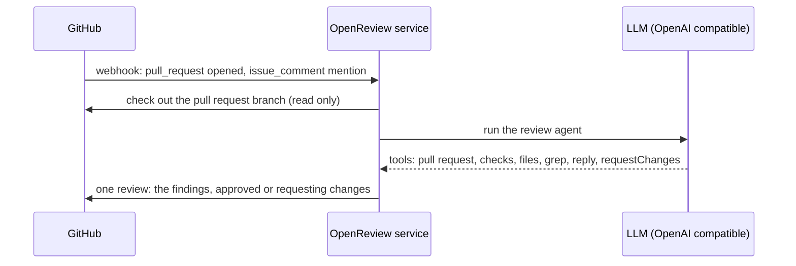

# OpenReview

An AI code review bot for GitHub pull requests. This is a fork of
[vercel-labs/openreview](https://github.com/vercel-labs/openreview) that runs as a
plain Node service on your own host instead of on Vercel.

- **No serverless platform** — one `node dist/server.js` process behind a reverse proxy.
- **Read-only** — the reviewed branch is checked out and read; the agent has no shell, no
  package manager and no build tooling, so nothing from the pull request is ever executed.
- **Any OpenAI-compatible model** — point `LLM_BASE_URL` at your own gateway.
- **Automatic reviews** — new and updated pull requests are reviewed without a mention.
- **Automatic approval** — a pull request is approved when the review does not request changes.

## How it works



The agent reads the diff, the CI results and the surrounding code, and writes with the
`reply` tool; the pipeline submits exactly one review carrying that text, so a pull request
never gets both a comment and a review for the same run.

Triggers:

1. `pull_request` — `opened`, `reopened`, `ready_for_review`, `synchronize`.
2. `issue_comment` — mentioning the bot, for example `@openreview review the error handling`.
3. `pull_request_review_comment` — mentioning the bot inside an inline review thread.

Events raised by the app itself are ignored, so the commit the agent pushes does not
start another review.

Authorisation, because every review costs tokens:

- A mention only starts a review when the comment author's `author_association` is in
  `TRUSTED_ASSOCIATIONS` (default: `OWNER`, `MEMBER`, `COLLABORATOR`). Mentions from
  everyone else are logged and ignored, which matters when the repository is public.
- Pull requests from forks are skipped (`REVIEW_FORK_PRS=false`): a fork can only be
  pushed to by its owner. Pull requests for branches in the repository itself, including
  bot branches such as dependabot's, are reviewed as usual.

Approval rules:

- The agent calls `requestChanges` when it finds a critical problem, and the review is
  then submitted as a change request.
- Otherwise the review is submitted as an approval (`AUTO_APPROVE=true`, the default) or
  as a plain comment (`AUTO_APPROVE=false`).
- Drafts and closed pull requests are skipped; in that case the findings are posted as a
  comment so nothing is lost.
- A review with no text at all is never submitted: an agent that reported nothing is not a
  reason to approve.
- A pull request that is already approved is not approved twice. A change request made
  during the same run is never followed by an approval, while a change request from an
  earlier run does not block the next review from approving.

## Local development

```bash
npm install
cp .env.example .env   # fill in the values
npm run dev            # builds and starts on http://127.0.0.1:8090
```

`npm run build` bundles everything into `dist/server.js`; the deployed host needs no
`node_modules`. `npm run typecheck` runs `tsc`.

## Environment

| Variable | Required | Description |
| --- | --- | --- |
| `GITHUB_APP_ID` | yes | GitHub App id |
| `GITHUB_APP_INSTALLATION_ID` | yes | Installation id on the target account |
| `GITHUB_APP_PRIVATE_KEY` | yes | PEM private key (`\n` for newlines) |
| `GITHUB_APP_WEBHOOK_SECRET` | yes | Webhook secret |
| `LLM_BASE_URL` | yes | OpenAI-compatible base URL, including `/v1` |
| `LLM_API_KEY` | yes | API key for that endpoint |
| `LLM_MODEL` | yes | Model name |
| `AUTO_APPROVE` | no | Approve when no review requested changes (default `true`) |
| `TRUSTED_ASSOCIATIONS` | no | `author_association` values allowed to start a review by mentioning the bot (default `OWNER,MEMBER,COLLABORATOR`) |
| `REVIEW_FORK_PRS` | no | Review pull requests from forks (default `false`) |
| `WORKSPACE_ROOT` | no | Where pull request branches are checked out (default `workspaces`) |
| `HOST` / `PORT` | no | Listen address (default `127.0.0.1:8090`) |
| `LOG_LEVEL` | no | `debug`, `info`, `warn`, `error` (default `info`) |
| `MAX_AGENT_STEPS` | no | Tool loop budget (default `20`) |
| `RUN_TIMEOUT_MS` | no | Limit for one review (default `1800000`) |

## Deploy

The service serves two routes: `POST /webhook` (also aliased as `/api/webhooks`) and
`GET /healthz`.

1. Build the bundle on a machine with a normal toolchain:
   `npm install && npm run build`
2. Copy to the host: `dist/server.js`, `dist/server.js.map`, `.agents/` (the review
   skills) and a `.env` with the variables above. The host needs Node 20.9+ and `git`
   (for the read-only checkout) and nothing else.
3. Run it under systemd:

```ini
[Unit]
Description=OpenReview
After=network.target

[Service]
Type=simple
User=ubuntu
WorkingDirectory=/opt/openreview
ExecStart=/usr/bin/node --env-file=/opt/openreview/.env /opt/openreview/dist/server.js
Restart=always
RestartSec=5

# Reviews install dependencies and run project tooling on the host. Cap the
# cgroup so a runaway command cannot starve the machine.
CPUQuota=150%
MemoryHigh=600M
MemoryMax=800M
TasksMax=256

[Install]
WantedBy=multi-user.target
```

4. Terminate TLS in front of it. With Caddy:

```
https://bot.example.com {
	reverse_proxy 127.0.0.1:8090
}
```

## GitHub App

Repository permissions: **Contents** read and write, **Issues** read and write,
**Pull requests** read and write, **Metadata** read-only.

Events: **Issue comment**, **Pull request**, **Pull request review comment**.

Webhook URL: `https://<your-host>/webhook`, content type `application/json`.

## Security

- The service never executes anything from a pull request. There is no shell tool, no
  dependency installation and no build step: the branch is checked out read-only
  (`git clone`, hooks disabled, and it is the only subprocess the service starts) and the
  agent's tools only read files or query the GitHub API. This is enforced by the shape of
  the tool set, not by prompting.
- The service cannot modify pull requests beyond reviewing them: findings are submitted
  as a review, and no code is ever pushed to a branch.
- Reviews are serialised — one checkout and one agent run at a time.
- Each run gets its own temporary directory with mode `0700`, removed when the review
  finishes. Stale directories are cleaned up on startup.
- The installation token is only used to check the branch out and to call the API.
- The systemd unit caps the service cgroup (`CPUQuota`, `MemoryMax`, `TasksMax`) so a
  runaway review cannot starve the host.

## Differences from upstream

- Next.js, Vercel Workflow, Vercel Sandbox, the Upstash Redis state adapter and the demo
  web UI are gone. The review pipeline is a plain async function queue in `review/`.
- The agent is an AI SDK `ToolLoopAgent` against an OpenAI-compatible endpoint instead of
  a Claude model through the AI Gateway.
- The agent runs no code: upstream gave it a sandboxed shell, a file writer and the `gh`
  CLI. Here it gets pull request, check, file-list, file-read and grep tools instead, so
  installs, builds and pushes are impossible rather than merely discouraged.
- `pull_request` events are handled directly in `lib/bot.ts`, since the GitHub chat
  adapter only receives comments, and `review/submit-review.ts` submits the single
  review with the verdict.
- Skills are read from `.agents/skills` next to the service, as upstream does.

## Known limitations

- The agent cannot run the linter, the tests or a build; it reads the code and the CI
  results instead. Findings that would need execution are reported as such.
- GitHub does not deliver reaction webhooks, so reacting to a comment cannot trigger
  anything. Upstream's 👍/❤️ handlers are inert here for the same reason.
- One process handles reviews sequentially; a restart drops queued reviews.
- No review dashboard or streamed progress: results are posted on the pull request.

## License

MIT
