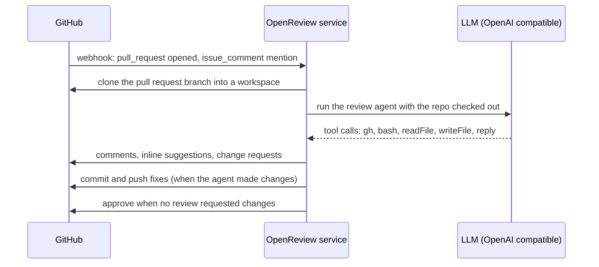

# OpenReview

An AI code review bot for GitHub pull requests. This is a fork of
[vercel-labs/openreview](https://github.com/vercel-labs/openreview) that runs as a
plain Node service on your own host instead of on Vercel.

- **No serverless platform** — one `node dist/server.js` process behind a reverse proxy.
- **No sandbox service** — the pull request branch is cloned into a local workspace,
  which is where the agent runs commands.
- **Any OpenAI-compatible model** — point `LLM_BASE_URL` at your own gateway.
- **Automatic reviews** — new and updated pull requests are reviewed without a mention.
- **Automatic approval** — a pull request is approved when the review does not request changes.

## How it works



Triggers:

1. `pull_request` — `opened`, `reopened`, `ready_for_review`, `synchronize`.
2. `issue_comment` — mentioning the bot, for example `@openreview review the error handling`.
3. `pull_request_review_comment` — mentioning the bot inside an inline review thread.

Events raised by the app itself are ignored, so the commit the agent pushes does not
start another review.

Approval rules:

- The agent submits a change request (`gh pr review --request-changes`) when it finds a
  critical problem. Pull requests with such a review on the current head commit are
  never approved automatically.
- Otherwise the pull request is approved. Drafts and closed pull requests are skipped.
- Set `AUTO_APPROVE=false` to turn the approval off.

## Local development

```bash
npm install
cp .env.example .env   # fill in the values
npm run dev            # builds and starts on http://127.0.0.1:8090
```

`npm run build` bundles everything into `dist/server.js`; the deployed host needs no
`node_modules`. `npm run typecheck` runs `tsc`.

## Environment

| Variable | Required | Description |
| --- | --- | --- |
| `GITHUB_APP_ID` | yes | GitHub App id |
| `GITHUB_APP_INSTALLATION_ID` | yes | Installation id on the target account |
| `GITHUB_APP_PRIVATE_KEY` | yes | PEM private key (`\n` for newlines) |
| `GITHUB_APP_WEBHOOK_SECRET` | yes | Webhook secret |
| `LLM_BASE_URL` | yes | OpenAI-compatible base URL, including `/v1` |
| `LLM_API_KEY` | yes | API key for that endpoint |
| `LLM_MODEL` | yes | Model name |
| `AUTO_APPROVE` | no | Approve when no review requested changes (default `true`) |
| `WORKSPACE_ROOT` | no | Where pull request branches are cloned (default `workspaces`) |
| `HOST` / `PORT` | no | Listen address (default `127.0.0.1:8090`) |
| `LOG_LEVEL` | no | `debug`, `info`, `warn`, `error` (default `info`) |
| `MAX_AGENT_STEPS` | no | Tool loop budget (default `20`) |
| `RUN_TIMEOUT_MS` | no | Limit for one review (default `1800000`) |
| `BASH_TIMEOUT_MS` | no | Limit for one agent command (default `300000`) |

## Deploy

The service serves two routes: `POST /webhook` (also aliased as `/api/webhooks`) and
`GET /healthz`.

1. Build the bundle on a machine with a normal toolchain:
   `npm install && npm run build`
2. Copy to the host: `dist/server.js`, `dist/server.js.map`, `.agents/` (the review
   skills) and a `.env` with the variables above. The host needs Node 20.9+, `git`,
   `bash` and the `gh` CLI — the agent uses `gh` for pull request operations, and it is
   authenticated through the `GH_TOKEN` environment of each command.
3. Run it under systemd:

```ini
[Unit]
Description=OpenReview
After=network.target

[Service]
Type=simple
User=ubuntu
WorkingDirectory=/opt/openreview
ExecStart=/usr/bin/node --env-file=/opt/openreview/.env /opt/openreview/dist/server.js
Restart=always
RestartSec=5

# Reviews install dependencies and run project tooling on the host. Cap the
# cgroup so a runaway command cannot starve the machine.
CPUQuota=150%
MemoryHigh=600M
MemoryMax=800M
TasksMax=256

[Install]
WantedBy=multi-user.target
```

4. Terminate TLS in front of it. With Caddy:

```
https://bot.example.com {
	reverse_proxy 127.0.0.1:8090
}
```

## GitHub App

Repository permissions: **Contents** read and write, **Issues** read and write,
**Pull requests** read and write, **Metadata** read-only.

Events: **Issue comment**, **Pull request**, **Pull request review comment**.

Webhook URL: `https://<your-host>/webhook`, content type `application/json`.

## Security

- Reviews run pull request code on the host: dependencies are installed and the agent
  executes shell commands inside the workspace. Run this on a host you are willing to
  expose to repository code, and only on branches whose content you trust.
- Each run gets its own temporary directory with mode `0700`, removed when the review
  finishes. Stale directories are cleaned up on startup.
- Reviews are serialised — one workspace and one agent run at a time.
- Every command runs in its own process group and is killed with that group when it
  exceeds `BASH_TIMEOUT_MS`, or when the run as a whole exceeds `RUN_TIMEOUT_MS`.
- The installation token is passed through the environment of the commands that need it
  and is also kept in the workspace git remote, which is why the workspace stays private
  and is deleted after the run.
- Git hooks from the pull request branch are disabled (`core.hooksPath=/dev/null`), and
  `node_modules/` is excluded from commits the agent makes.

## Differences from upstream

- Next.js, Vercel Workflow, Vercel Sandbox, the Upstash Redis state adapter and the demo
  web UI are gone. The review pipeline is a plain async function queue in `review/`.
- The agent is an AI SDK `ToolLoopAgent` against an OpenAI-compatible endpoint instead of
  a Claude model through the AI Gateway.
- `pull_request` events are handled directly in `lib/bot.ts`, since the GitHub chat
  adapter only receives comments, and `review/approve-pr.ts` implements the automatic
  approval.
- Skills are read from `.agents/skills` next to the service, as upstream does.

## Known limitations

- GitHub does not deliver reaction webhooks, so reacting to a comment cannot trigger
  anything. Upstream's 👍/❤️ handlers are inert here for the same reason.
- One process handles reviews sequentially; a restart drops queued reviews.
- No review dashboard or streamed progress: results are posted on the pull request.

## License

MIT
